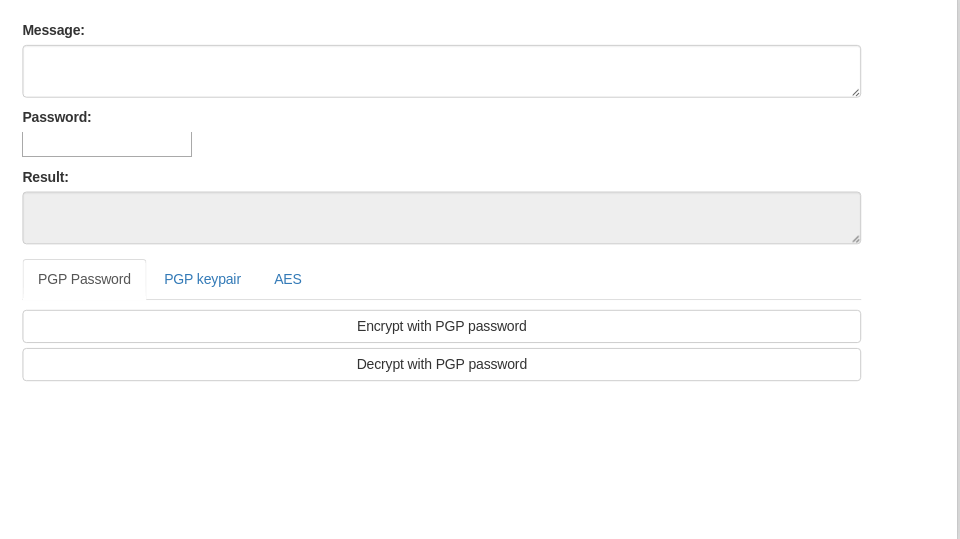
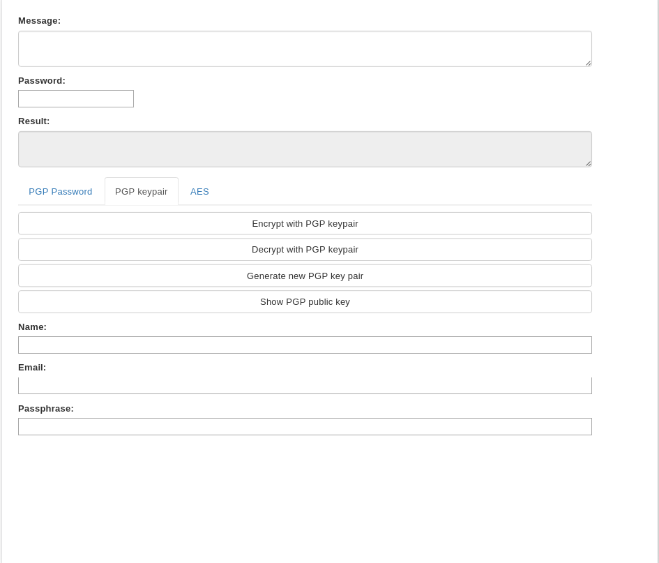
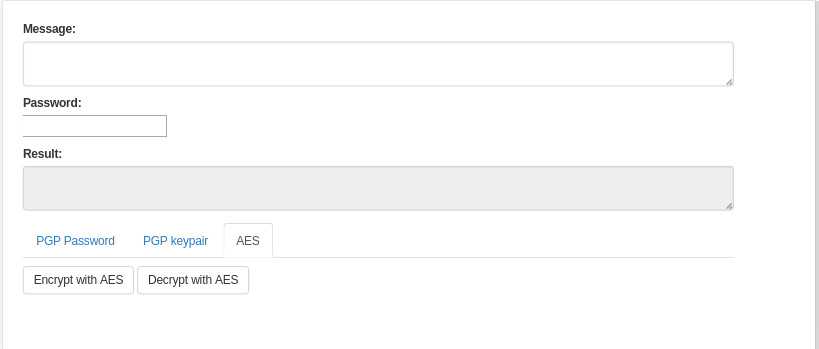

CS 460 final project

The html is in `app/popup.html`
All the encryption/decryption code resides in `app/scripts.babel/popup.js`

Encrypt/Decrypt with PGP password

Encrypt/Decrypt with PGP keypair

Encrypt/Decrypt with AES

